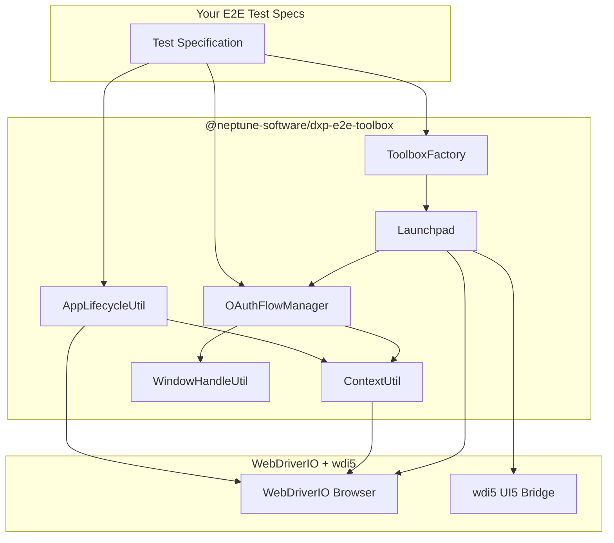
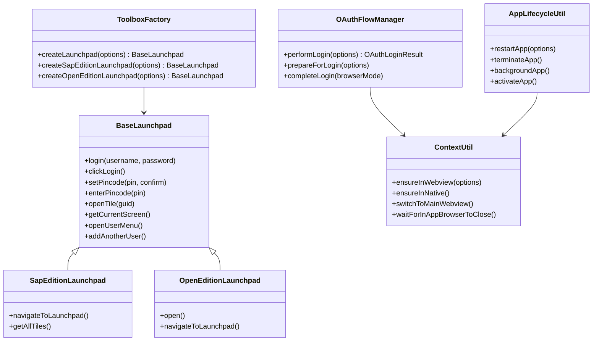
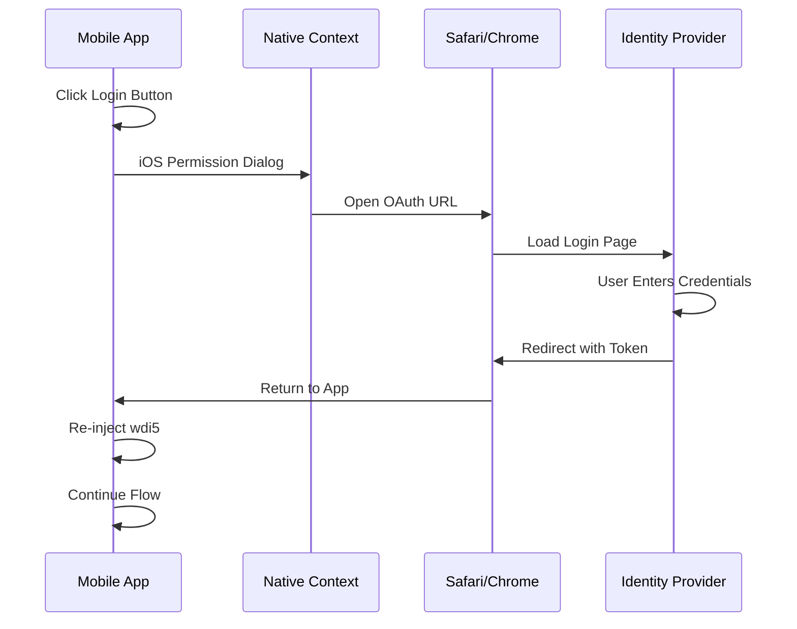
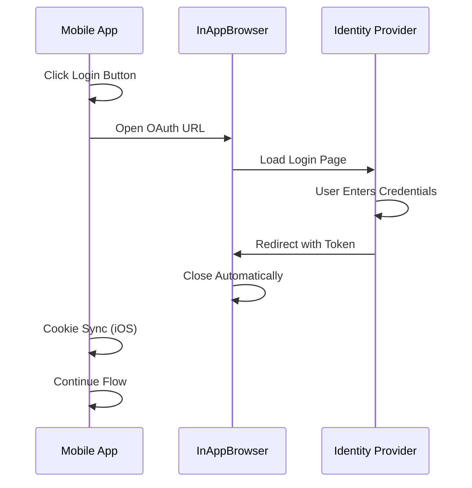

# @neptune-software/dxp-e2e-toolbox

A comprehensive E2E testing toolbox for Neptune DXP applications. Provides reusable page objects, helpers, and utilities for testing both SAP Edition and Open Edition launchpads.

## Table of Contents

- [Overview](#overview)
- [Features](#features)
- [Installation](#installation)
- [Architecture](#architecture)
- [Quick Start](#quick-start)
- [API Reference](#api-reference)
  - [ToolboxFactory](#toolboxfactory)
  - [Launchpad](#launchpad)
  - [OAuthFlowManager](#oauthflowmanager)
  - [ContextUtil](#contextutil)
  - [AppLifecycleUtil](#applifecycleutil)
  - [WindowHandleUtil](#windowhandleutil)
- [OAuth Flows](#oauth-flows)
- [Version Resolution](#version-resolution)
- [Known Issues](#known-issues)
- [Contributing](#contributing)

## Overview

The DXP E2E Toolbox abstracts away the complexity of testing Neptune DXP mobile and web applications. It provides:

- **Edition-aware page objects** for SAP Edition and Open Edition
- **Version-aware implementations** that adapt to different DXP versions
- **OAuth flow management** for Azure, Okta, and BTP IAS authentication
- **Context/WebView switching** for mobile app testing
- **App lifecycle management** for restart, background, and terminate operations



## Features

### Edition Support

| Edition | Status | Notes |
|---------|--------|-------|
| SAP Edition | ✅ Full Support | Versions 22, 22.10, 23+ |
| Open Edition | ✅ Full Support | All versions |

### Core Features

- **Factory Pattern** - Create launchpad instances with automatic version resolution
- **Fluent API** - Chainable methods for readable test code
- **Type Safety** - Full TypeScript support with UI5 types
- **Resilient Operations** - Built-in retries and error handling
- **OAuth Integration** - Azure AD, Okta, BTP IAS support

### Platform Support

| Platform | Status | Notes |
|----------|--------|-------|
| Android | ✅ Stable | BrowserStack and local Appium |
| iOS | ⚠️ Experimental | Known WebView/wdi5 flakiness issues |
| Browser | ✅ Stable | Chrome, Firefox, Safari |

## Installation

```bash
npm install @neptune-software/dxp-e2e-toolbox
```

### Peer Dependencies

```json
{
  "peerDependencies": {
    "webdriverio": "^9",
    "wdio-ui5-service": "^3",
    "expect-webdriverio": "^5"
  }
}
```

## Architecture

### Component Hierarchy



### Version Resolution

The toolbox uses a version resolver to pick the correct implementation based on DXP version:

```mermaid
flowchart LR
    subgraph Input
        V[Version: "24.14.1"]
        E[Edition: "sap-edition"]
    end
    
    subgraph VersionResolver
        R1{Match 24?}
        R2{Match 23?}
        R3{Match 22.10?}
        R4{Match 22?}
        RB[Use Base]
    end
    
    subgraph Implementations
        I23[LaunchpadV23]
        I22_10[LaunchpadV22_10]
        I22[LaunchpadV22]
        IB[BaseLaunchpad]
    end
    
    V --> R1
    R1 -->|No match| R2
    R2 -->|Match!| I23
    R1 -->|No 24 impl| R2
    R3 --> I22_10
    R4 --> I22
    RB --> IB
```

## Quick Start

### Basic Usage

```typescript
import { ToolboxFactory, OAuthFlowManager, initToolbox } from "@neptune-software/dxp-e2e-toolbox";

describe("My Test", () => {
  before(async () => {
    // Initialize toolbox with edition and version
    await initToolbox();
  });

  it("should login and open a tile", async () => {
    // Create a launchpad instance
    const launchpad = await ToolboxFactory.createLaunchpad({
      launchpadName: "MY_LAUNCHPAD",
    });

    // Perform basic login
    await launchpad.login("username", "password");

    // Set pincode
    await launchpad.setPincode("1234", "1234");
    await launchpad.enterPincode("1234");

    // Open a tile
    await launchpad.openTile("TILE_GUID");
  });
});
```

### OAuth Login

```typescript
import { OAuthFlowManager } from "@neptune-software/dxp-e2e-toolbox";

it("should login with Azure", async () => {
  const oauthManager = OAuthFlowManager.getInstance();

  const result = await oauthManager.performLogin({
    provider: "azure",
    browserMode: "native", // or "inappbrowser"
    launchpadName: "MY_OAUTH_LAUNCHPAD",
    credentials: {
      email: "user@example.com",
      password: "secret",
      staySignedIn: false,
    },
  });

  expect(result.success).toBe(true);
});
```

## API Reference

### ToolboxFactory

Static factory for creating edition/version-specific launchpad instances.

```typescript
// Auto-detect edition from environment
const launchpad = await ToolboxFactory.createLaunchpad({
  launchpadName: "MY_LAUNCHPAD",
});

// Explicit SAP Edition
const sapLaunchpad = await ToolboxFactory.createSapEditionLaunchpad({
  launchpadName: "MY_LAUNCHPAD",
  version: "23",
});

// Explicit Open Edition
const openLaunchpad = await ToolboxFactory.createOpenEditionLaunchpad({
  launchpadName: "MY_LAUNCHPAD",
});
```

### Launchpad

Page object for interacting with Neptune launchpad.

| Method | Description |
|--------|-------------|
| `login(username, password)` | Login with basic authentication |
| `clickLogin()` | Click the login button (for OAuth flows) |
| `setPincode(pin, confirm)` | Set a new pincode |
| `enterPincode(pin)` | Enter an existing pincode |
| `getCurrentScreen()` | Get the current screen identifier |
| `openTile(guid)` | Open a tile by GUID |
| `closeTile(guid)` | Close a tile by GUID |
| `openUserMenu()` | Open the user menu |
| `closeUserMenu()` | Close the user menu |
| `addAnotherUser()` | Add another user to the app |
| `selectUser(index)` | Select a user from the list |
| `lock()` | Lock the screen |

### OAuthFlowManager

Manages OAuth authentication flows for Azure, Okta, and BTP IAS.

```typescript
interface PerformOAuthLoginOptions {
  provider: "azure" | "okta" | "btp-ias" | "sap-basic" | "custom";
  credentials: {
    email: string;
    password: string;
    staySignedIn?: boolean;
    rememberMe?: boolean;
    keepMeSignedIn?: boolean;
  };
  browserMode?: "native" | "inappbrowser";
  launchpadName?: string;
  timeout?: number;
  customOAuthUrlPatterns?: string[];
  isOAuthPageCallback?: (url: string) => Promise<boolean>;
  customLoginHandler?: () => Promise<void>;
}

interface OAuthLoginResult {
  success: boolean;
  autoTriggered: boolean;
  browserMode: "native" | "inappbrowser";
  loginContext?: Context;
  error?: string;
}
```

### ContextUtil

Utility for managing WebView and native contexts in mobile apps.

| Method | Description |
|--------|-------------|
| `ensureInWebview(options)` | Switch to main app WebView |
| `ensureInNative()` | Switch to native context |
| `switchToMainWebview()` | Find and switch to main WebView |
| `waitForInAppBrowserToClose(timeout)` | Wait for InAppBrowser to close |
| `getCurrentContext()` | Get current context info |
| `getAllContexts()` | Get all available contexts |

### AppLifecycleUtil

Utility for managing app lifecycle (restart, background, etc.).

| Method | Description |
|--------|-------------|
| `restartApp(options)` | Restart the app |
| `terminateApp()` | Terminate the app |
| `backgroundApp(duration)` | Background the app |
| `activateApp()` | Activate/foreground the app |
| `getAppId()` | Get the app package/bundle ID |
| `waitForSplashScreenGone()` | Wait for splash screen to disappear |

**Restart Modes:**

| Mode | Behavior |
|------|----------|
| `fresh` | Relaunch app - preserves localStorage, shows initial screen |
| `resume` | Background and activate - resumes exactly where you were |
| `clean` | Terminate and activate - clears ALL data |

## OAuth Flows

### Native Browser Flow (Safari/Chrome)



### InAppBrowser Flow (Cordova)



### Supported Providers

| Provider | URL Patterns |
|----------|--------------|
| Azure AD | `login.microsoftonline.com`, `login.windows.net` |
| Okta | `*.okta.com`, `*.oktapreview.com` |
| BTP IAS | `accounts.sap.com`, `*.authentication.*` |

## Version Resolution

The toolbox automatically selects the correct implementation based on DXP version:

| Version Pattern | Implementation |
|-----------------|----------------|
| `24.*`, `23.*` | LaunchpadV23 |
| `22.10.*` | LaunchpadV22_10 |
| `22.*` | LaunchpadV22 |
| `*` (fallback) | BaseLaunchpad |

### Environment Variables

| Variable | Description | Default |
|----------|-------------|---------|
| `NEPTUNE_EDITION` | Edition type (`sap-edition` or `open-edition`) | `sap-edition` |
| `NEPTUNE_VERSION` | DXP version (e.g., `24.14.1`) | `23` |

## Known Issues

### iOS WebView Flakiness

iOS testing with WebViews and wdi5 can be unreliable due to:

1. **Safari Remote Debugger instability** - The debugger connection can become corrupted after context switches
2. **wdi5 injection failures** - After OAuth flows or app restarts, wdi5 may fail to reinject
3. **Context switching timing** - iOS WebViews can take longer to stabilize than Android

**Workarounds implemented:**
- Aggressive context reset after OAuth flows
- Multiple wdi5 injection retries
- Warmup execute calls to prime the debugger connection
- Extended timeouts for iOS operations

**Recommendation:** For production CI/CD, prioritize Android testing. iOS testing should be considered experimental.

### iOS Cookie Sync InAppBrowser

On iOS with InAppBrowser OAuth flows, the Neptune framework may open a secondary InAppBrowser for cookie synchronization after PIN entry. This can sometimes show a blank screen if:

- Network connectivity issues
- Auth token expiration
- Framework configuration issues

The toolbox includes detection and timeout handling for this scenario.

## Contributing

### Development Setup

```bash
# Clone the repository
git clone https://github.com/neptune-software/dxp-e2e-toolbox.git

# Install dependencies
npm install

# Build
npm run build

# Link for local development
npm link
```

### Adding a New Version Implementation

1. Create a new file in `src/sap-edition/versions/` or `src/open-edition/versions/`
2. Extend the base launchpad class
3. Register in `ToolboxFactory.initResolvers()`

```typescript
// src/sap-edition/versions/launchpad-v25.ts
import { SapEditionLaunchpad } from "../launchpad.js";

export class SapEditionLaunchpadV25 extends SapEditionLaunchpad {
  // Override methods as needed for v25 changes
}

// In ToolboxFactory.initResolvers():
this.sapEditionResolver.register("25", async () => {
  const { SapEditionLaunchpadV25 } = await import("../sap-edition/versions/launchpad-v25.js");
  return SapEditionLaunchpadV25;
});
```

### Adding a New OAuth Provider

1. Create a new file in `src/oauth/`
2. Extend `OAuthProvider` base class
3. Add to `OAuthFlowManager.executeOAuthLogin()`

```typescript
// src/oauth/my-provider-login.ts
import { OAuthProvider } from "./oauth-provider.js";

export class MyProviderLogin extends OAuthProvider {
  public async login(options: MyProviderLoginOptions): Promise<void> {
    // Implement login flow
  }
}
```

## License

MIT
